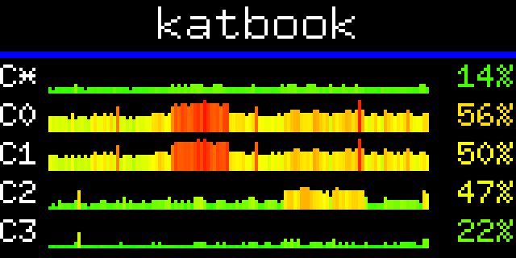
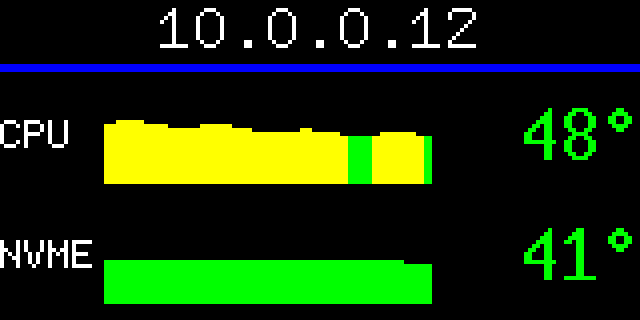
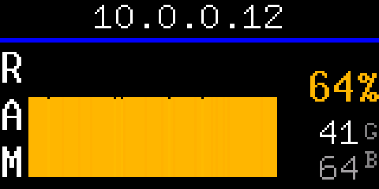
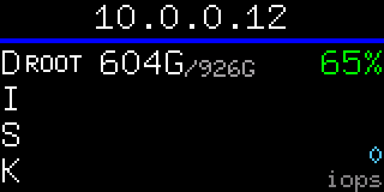
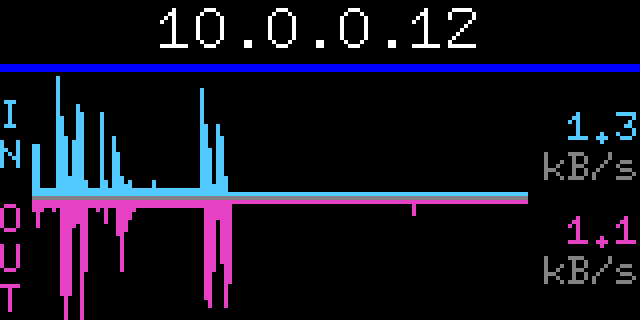
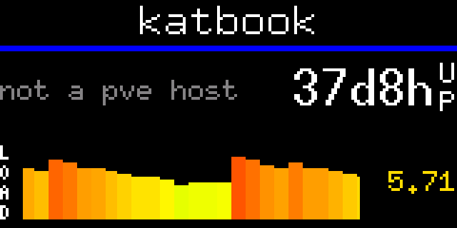

# i2c-proxmox-status

[](https://github.com/katbyte/i2c-proxmox-status/releases/latest)


[](https://github.com/katbyte/i2c-proxmox-status/blob/main/LICENSE)

Host stats on the front-panel LCD of the UCTRONICS Pi Rack Pro (19" 1U rack
mount for Raspberry Pi, SKU RM0004). A ground-up Rust rewrite of the C
display daemon from
[UCTRONICS/SKU_RM0004](https://github.com/UCTRONICS/SKU_RM0004); the
original C and Python sources remain in git history.

Rotates the 160x80 panel through btop-style stat pages under a header line
that pages between the IP and the hostname and doubles as a status light.
Stats come from the [sysinfo](https://crates.io/crates/sysinfo) crate plus
direct reads of `/proc`, `/sys`, and `/etc/pve`. A rack full of Pis can
[rotate in lockstep](#syncing-panels-across-pis) — every panel showing the
same page at the same moment — with nothing but their clocks.

## Pages

Selected and ordered with `--pages` (comma separated). The default rotation
is `cpus,temps,mem,disks,network,proxmox,warnings`. Screenshots are from the
simulator at 4x.

### `cpus`



btop-style per-core view: a total-CPU history sparkline on top (`C*`), then
a sparkline and current percent per core, every sample colored on btop's
green→yellow→red gradient by load. A background thread samples usage
continuously so the history keeps moving while other pages show;
`--page-history <secs>` sets how much history spans the graphs (default 2
minutes, one sample per pixel column).

### `temps`



CPU/SoC and NVMe temperatures, one row per sensor: a history sparkline plus
a big live reading, both colored by status (green under 50°, yellow to 65°,
orange to 75°, red above). Sensors are matched from the kernel's hwmon
labels (cpu_thermal / coretemp / k10temp for the CPU, the NVMe Composite
sensor); rows only appear for sensors that exist. Temperatures drift
slowly, so this page gets a much longer window: `--temp-history <secs>`
(default 1 hour). Simulator builds mock the sensors when the host exposes
none.

### `mem`



Memory usage: a full-height history sparkline on the load gradient
(`--mem-history` window, default 1 hour), the big current percent, and used
over total (dimmed) with a vertical `GB` unit column.

### `disks`



One line per filesystem — `ROOT` (via `statvfs("/")`, so LVM and ZFS
roots work) and, on a Proxmox host, `VM`: the node's own VM-image
storage — local block-backed types only (lvmthin / lvm / zfspool / btrfs);
shared storages (cifs/nfs/pbs) aren't this node's disk and dir storages
already sit on a filesystem the `ROOT` row shows, so both are excluded —
polled once a minute from `pvesh get /nodes/<node>/storage`, falling back
to reading `/etc/pve/storage.cfg` and querying each backend directly
(`lvs` for thin pools, `zfs list` for ZFS, `vgs` for fat LVM, statvfs for
dir storages) where pvesh's IPC is broken, as on Pimox. Each line shows
used/total and a percent colored by fullness. Below, a disk IOPS
sparkline scaled to the window's peak (whole physical disks summed from
`/proc/diskstats`); `--io-history <secs>` sets its window (default 5
minutes). The screenshot is from a non-Proxmox host, so only `ROOT`
shows.

### `disks-single-bar`

The previous disk-page look, kept for anyone who prefers it (not in the
default rotation): a single root-filesystem bar with a doubled-up percent,
over the same IOPS sparkline. No VM storage row.

### `network`



Throughput in btop's style: one graph split at a center line, receive
climbing up from it and transmit hanging down, each half auto-scaled to its
own peak, with vertical `IN`/`OUT` labels and the current rates (number
over its auto-scaled unit — `B/s`, `kB/s`, `MB/s`). Physical interfaces
only (`en*`/`eth*`/`wl*` — bridges and taps mirror the same packets, so
counting them would double everything); `--net-history` sets the window
(default and minimum 5 minutes).

### `proxmox`



Running/defined VM count for the local node — read straight off `/etc/pve`
and the qemu pidfiles, no API or auth needed — with a big uptime, over a
cpus-style load-average history row (scaled as percent of core count, so
1.0 per core pins the graph). Shows "not a pve host" off-Proxmox, as above.

### `warnings`

Host problems, one line each: the Pi firmware's throttling flags
(under-voltage, frequency capping, throttling, soft temp limit — current
ones red, since-boot ones yellow), overheating sensors (≥75°/85°), disks
≥90% full, RAM ≥95%. The page removes itself from the rotation while
everything is clear, so seeing it at all means something's wrong — no
screenshot because a healthy host never shows it.

### `uctronics-*`

`uctronics-cpu`, `uctronics-ram`, `uctronics-temp`, `uctronics-disk` — the
single-stat gauge screens carried over from the original C firmware.

## Rotation and timing

Every page holds for `--page-hold` seconds (default 7), counted from when
the page is fully on the glass. While a page is up, its live readings and
graphs redraw at most once per `--page-refresh` seconds (default 1); a
refresh due on the same frame as a header change waits one frame, so the
header's flush gets the bus to itself.

`--page-mode <cut|wipe-up|wipe-down|wipe-left|wipe-right>` picks the
transition between pages: `cut` (default) switches instantly; the wipes
slide the old page out and the next in over a few large steps, since every
step redraws the whole page area (~450ms each on the real bus).

`--clock-sync <minutes>` drives the rotation from the wall clock instead of
free-running: the rotation restarts from the first page at every multiple
of that many minutes past the hour (`10` → :00, :10, :20 …), with pages
advancing on fixed `--page-hold` slots in between. Panels on several hosts
running the same page list then show the same page at the same moment.

Every `--repaint` seconds (default 60, `0` disables) the next page change
resends the entire frame instead of just the diff — self-repair in case
the display bridge ever dropped or displaced rows, invisible when nothing
was wrong.

On exit the daemon leaves a full-screen message on the panel (the bridge
MCU keeps showing the last frame after the process stops): `--close-text`
(default `CLOSED`, white) on a clean exit via ctrl-c/SIGTERM, and
`--crash-text` (default `CRASH`, red) if the daemon panics.

## Syncing panels across Pis

With several trays in the rack, staggered rotations look messy. Pass
`--clock-sync <minutes>` on every host and the panels rotate in lockstep
with no communication between them: the current page is computed purely
from unix time, so hosts with synced clocks (NTP — chrony or
systemd-timesyncd, already running on any Proxmox or Raspberry Pi OS
install) land on the same page at the same moment. The rotation restarts
from the first page at each period boundary — `--clock-sync 10` means
:00, :10, :20 … past every hour.

For it to line up, every host must run the **same `--pages` list and the
same `--page-hold`** (they define the slot layout). Installed as the
systemd service, add the flag with a drop-in on each host:

```bash
sudo systemctl edit i2c-proxmox-status
```

```ini
[Service]
ExecStart=
ExecStart=/usr/local/bin/i2c-proxmox-status --clock-sync 10
```

then `sudo systemctl restart i2c-proxmox-status`.

One caveat: the `warnings` page only shows on a host that has warnings.
During its slot, healthy panels skip ahead to the next page while an
unhealthy one shows its warnings; everything realigns on the next slot —
arguably a feature, since the odd panel out is the one that needs
attention.

## The header

The `ip - hostname` line is drawn on the glass before anything else at
startup, and its text doubles as a status light: white while the host is
healthy, then yellow / orange / red as the hottest temperature sensor
(65/75/85°) or root filesystem fullness (80/90/95%) escalates. Active Pi
throttling flags go straight to red; since-boot flags show yellow.

- `--host <hostname|fqdn>` — short hostname (default) or the FQDN
- `--header-mode <cut|slide|wipe-up|wipe-down|wipe-left|wipe-right>` — the
  cut and wipe modes page between the IP and the hostname (a part still too
  wide is further split to the display width), holding each for
  `--header-hold` seconds (default 10). `cut` (the default) swaps
  instantly — no animation, so the only bus cost is one band flush per
  swap, deferred while a page transition is animating; the wipes slide to
  the next page in the given direction. `slide` shows everything at once,
  as a continuous 1px marquee when too wide (which re-sends the header band
  every frame, competing with page updates for the bus)
- `--header-align <left|center|right>` — where text sits when it doesn't
  fill the width (default `center`; `centre` works too)
- `--header-sync` — the header changes only at the moment the page
  rotation changes (once `--header-hold` has elapsed), so with matching
  wipe modes the header and page slide in step

## Install

Needs Rust 1.85+ (`apt install cargo` on Debian 13 is enough) and I2C
enabled on the Pi — in `/boot/firmware/config.txt` (or `/boot/config.txt`
on older OS releases):

```
dtparam=i2c_arm=on,i2c_arm_baudrate=400000
```

Then, on the Pi:

```bash
sudo make install
```

which release-builds the daemon, installs it to `/usr/local/bin`, installs
the systemd unit from `packaging/`, and enables + starts it — it runs at
boot from then on. `sudo make uninstall` reverses all of it. To run it by
hand instead:

```bash
cargo build --release
sudo ./target/release/i2c-proxmox-status   # sudo unless your user is in the i2c group
```

Dependencies are vendored: all crate sources live in `vendor/` and
`.cargo/config.toml` points builds at it, so no network access is needed.
After changing anything in `Cargo.toml`, refresh it with `cargo vendor`.

## Development

### Simulator

Preview the display on a desktop without the hardware:

```bash
make sim    # = cargo run --features simulator -- --simulator; needs SDL2 (brew install sdl2 / apt install libsdl2-dev)
```

The cargo feature controls whether SDL2 is linked at all (so the Pi build
never needs it); the `--simulator`/`-s` flag selects it at runtime.

Opens a 4x-scaled window driven by the exact same compose/flush path as the
real panel. Blits sleep through a timing model of the I2C bus (wire time,
chunk pauses, session command overhead), so the marquee cadence and
screen-switch hitches match what the rack shows — design against the
simulator, then just rebuild on the Pi. The model is a close approximation
of measured hardware behavior, not a cycle-exact emulation.

With `SIM_SNAPSHOT_DIR=<dir>` set, the simulator also saves a PNG of the
panel once a second (`frame_0000.png`, …) — handy for reviewing layouts
(it's how the screenshots above were made). Simulator builds mock the
temperature sensors when the host has none, so the temps page shows data.

### Lint and test

```bash
make lint   # rustfmt --check + clippy with warnings as errors (what CI enforces)
make test
make fmt    # reformat
```

CI (GitHub Actions) runs build, test, and lint on every push and PR.

## How the display works

Each Pi tray on the rack has a 0.96" 160x80 color LCD. The panel itself is
driven by an ST7735 controller, but the Pi never talks to the ST7735
directly — an on-board microcontroller (which also handles the power button
and safe shutdown) owns the panel and exposes a small register interface to
the Pi over I2C at address `0x18`. `i2cdetect -y 1` showing a device at
`0x18` confirms this variant of the hardware.

### The bridge protocol

Every transaction the Pi sends is three bytes — `[register, high, low]`:

| Register | Purpose |
|----------|---------|
| `0x2A`   | X window: start column in `high`, end column in `low` |
| `0x2B`   | Y window: start row in `high`, end row in `low` |
| `0x2C`   | commit the window |
| `0x00`   | write one pixel: RGB565 color split into `high`/`low` |
| `0x01`   | burst mode on (`low=1`) / off (`low=0`) |
| `0x03`   | sync — tells the MCU to flush to the panel |

Drawing means: set an address window (a rectangle), then stream one RGB565
value per pixel into it, left-to-right, top-to-bottom. The register numbers
`0x2A`/`0x2B`/`0x2C` mirror the real ST7735 CASET/RASET/RAMWR commands the
MCU issues on the other side.

Quirks the driver has to honor:

- **Panel offset** — the 160x80 module is a windowed slice of the ST7735's
  native 162x132 RAM, mounted rotated. In this orientation every Y
  coordinate is offset by 24 rows (`Y_START` in `src/st7735.rs`).
- **Pacing** — the MCU needs breathing room: ~10µs after each 3-byte
  transaction, burst writes chunked to 160 bytes with ~700µs between
  chunks, and ~10ms after each sync while it flushes the session to the
  glass — commands sent during that flush are silently dropped, which
  displaces the rows that follow.
- **Session size** — a single burst session longer than ~5KB (16 full-width
  rows) overruns the bridge and the content lands displaced on the panel.
  Tall blits are split into 8-row windows — half that verified maximum,
  since the first rows of a session were still occasionally lost at 16.
- **Wake-up** — after ~500ms of bus idle the first transactions of the next
  batch have been seen to vanish, so a quiet spell ends with a harmless
  sync as a nudge (plus its settle) before any real commands.

Single-pixel writes (register `0x00`) cost one I2C transaction per pixel,
so this daemon never uses them: everything goes through burst mode — enable
register `0x01`, stream raw pixel bytes in 160-byte chunks, disable, sync.

### Framebuffer and differential flushing

The I2C bus is the bottleneck: ~40 KB/s at 400kHz means a full-screen push
(25.6 KB) takes ~0.9s with the pacing pauses, and a 160x16 header band
~170ms — about 6fps at best.
So nothing draws to the display directly. Each frame is composed into an
in-memory framebuffer (`src/framebuffer.rs`), which implements
[embedded-graphics](https://crates.io/crates/embedded-graphics)'
`DrawTarget`, so text, rectangles, and the rest of its primitives all render
into RAM for free. `flush()` then diffs the frame against a copy of what the
display currently shows and pushes only the changed rows, top to bottom
(contiguous dirty rows as one full-width burst blit each — the bridge MCU
misbehaves with narrow windows at arbitrary offsets, so bands are never
column-trimmed).

Fonts come from embedded-graphics' built-in monospace set (9x15 for the
header, 10x20 for the big values, 6x10 for the rest).

### Pages internally

`src/screens.rs` implements the header and the pages. Each `Page` renders
into the 160x61 area under the divider through a clipped+translated draw
target, so pages draw in local coordinates from (0,0) and the same render
code works mid-wipe at an offset. Main clears the page area and re-renders
the current page on each refresh tick; the diff flush works out what
actually needs to hit the bus. A `Page` can also decline to be shown
(`active()`), which is how the warnings page stays out of the rotation on a
healthy host. Stat history lives in a background sampler thread with one
sampling interval per series — `window seconds / graph columns`, so one
sample lands per pixel column and every graph spans exactly its configured
window.

## Layout

- `src/st7735.rs` — display transport (the bridge's I2C register protocol)
- `src/sim.rs` — SDL simulator transport with an I2C timing model (`--features simulator`)
- `src/framebuffer.rs` — embedded-graphics `DrawTarget` + differential flush
- `src/stats.rs` — stat collection (sysinfo crate), the per-series history sampler thread, Proxmox guest counts and VM storage, throttling flags, warnings, IP/hostname helpers
- `src/screens.rs` — header animations, `Page` trait, the pages
- `src/main.rs` — the compose/flush loop and rotation
- `packaging/` — the systemd unit `make install` deploys
- `docs/screenshots/` — simulator captures used above

The end goal is to also show cluster-wide stats pulled from the Proxmox
API instead of only local readings; that part isn't built yet.
